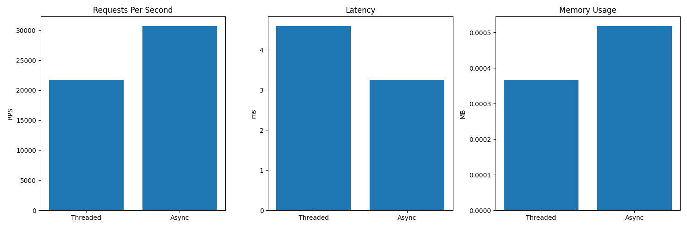

---

# Сравнение моделей TCP Echo-сервера на Python

Проект сравнивает производительность двух моделей реализации TCP Echo-сервера:


## Запуск теста

1. Убедитесь, что порты 8888 и 8889 свободны:

```bash
netstat -tuln | grep 8888
lsof -i :8888
kill -9 <pid>
````

2. Запуск теста:

```bash
python main.py
```

3. После завершения:

* `results.json` — численные результаты
* `results.png` — график сравнений

---

## Результаты

* Threaded-сервер показал стабильную производительность при умеренной нагрузке с контролируемым потреблением памяти.
* Async-сервер дал более высокую производительность (RPS) и меньшую задержку на малых объемах данных, но начал потреблять больше памяти при увеличении размера сообщений из-за особенностей буферизации в asyncio.

---

## Визуализация



---

## Состав проекта

| Файл                 | Описание                           |
| -------------------- | ---------------------------------- |
| `threaded_server.py` | Реализация сервера на threading    |
| `async_server.py`    | Реализация сервера на asyncio      |
| `tester.py`          | Нагрузочное тестирование и метрики |
| `main.py`            | Точка входа для запуска теста      |
| `requirements.txt`   | Список зависимостей                |
| `results.json`       | Численные результаты тестов        |
| `results.png`        | График сравнений                   |

---


